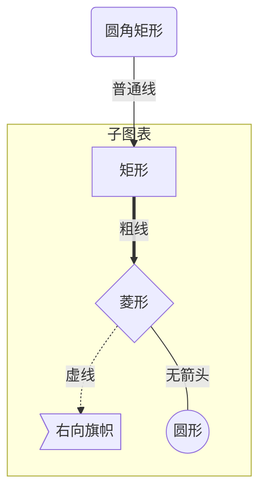

mermaid流程图
```
Mermaid 是一个用于画流程图、状态图、时序图、甘特图的库，使用 JS 进行本地渲染，广泛集成于许多 Markdown 编辑器中。
为知笔记不支持mermaid插件，暂时不管了。


folw流程图
```
注意：流程图只有一条流程可以走得通，只有选择condition才有下属分支
参考：https://www.jianshu.com/p/8c7812fd80b3
格式：将流程图代码包含在```folw和```之间即可
语法：流程图分为两块，上面一块创建流程图中的元素，隔一行，下面一块创建流程的走向
创建元素：tag=>type: content:>url
    tag是元素的标签，第二部分连接元素时要用到，名称任意。
    type为元素的类型，有六种：start、end、operation、subroutine、condition、inputoutput
    content是流程图中文本框的描述内容，中英文均可
    url是文本框绑定的链接，可省略
创建流程：tag(标识)->next_tag
    对于condition类型，有yes和no两个类型，如cond(yes)和cond(no)，也可以设置分支走向，如cond(yes,right)

示例：
st=>start: 开始
e=>end: 登录
io1=>inputoutput: 输入用户名密码
sub1=>subroutine: 数据库查询子类
cond=>condition: 是否有此用户
cond2=>condition: 密码是否正确
op=>operation: 读入用户信息

st->io1->sub1->cond
cond(yes,right)->cond2
cond(no)->io1(right)
cond2(yes,right)->op->e
cond2(no)->io1
```
```flow
st=>start: 开始
e=>end: 登录
io1=>inputoutput: 输入用户名密码
sub1=>subroutine: 数据库查询子类
cond=>condition: 是否有此用户
cond2=>condition: 密码是否正确
op=>operation: 读入用户信息

st->io1->sub1->cond
cond(yes,right)->cond2
cond(no)->io1(right)
cond2(yes,right)->op->e
cond2(no)->io1
```
简单表格
```
可以采用最简单的表格语法，也可以用HTML表格（较灵活）
<table class="table table-bordered table-striped table-condensed">
    <tr> <td>北京</td> <td>雾霾</td>
    </tr>
    <tr> <td>深圳</td> <td>暴雨</td>
    </tr>
</table>
```
<table class="table table-bordered table-striped table-condensed">
    <tr> <td>北京</td> <td>雾霾</td>
    </tr>
    <tr> <td>深圳</td> <td>暴雨</td>
    </tr>
</table>
在为知笔记添加Wiz.Editor.md插件
> 一个基于 Editor.md 构建的为知笔记 Markdown 插件.
这个插件还是挺好用的，只要不涉及图片
官网上面的README里面的内容是不对的，不是直接安装的，而是在官网下载好压缩包后，解压到xxx\Plugins\Wiz.editor.md文件夹中，然后重启为知笔记即可。

如何让markdown语法不显示：
>
在*-等符号前加转义字符\
用>加五个空格后显示
在代码框内显示

标题:在 标题开头 加上1~6个#，依次代表一级标题、二级标题....六级标题
```
# 1
## 2
### 3
#### 4
标题:在 标题底下 加上任意个=代表一级标题，-代表二级标题
1
=
2
-
```
无序列表：用*或-或+
* red
- green
+ blue

有序列表：有序列表则使用数字接着一个英文句点
1. red
1. green
1. blue

引用：分别用1~4个>表示几级引用

>1
>> 2
>>> 3
>>>> 4

>     int a;//应用的代码块在`>`后面有 5 个空格

强调
>     两个*或-代表加粗，一个*或-代表斜体，~~代表删除。
**强调**
-斜体-
~~删除~~

代码
``` C++
vector<int> vec;
cout<<"Hello World"<<endl;\\这是code
```
分割线：
>在一行中用三个以上的*、-、_来建立一个分隔线，行内不能有其他东西。也可以在符号间插入空格。
1
***
1
---
1
___
1
